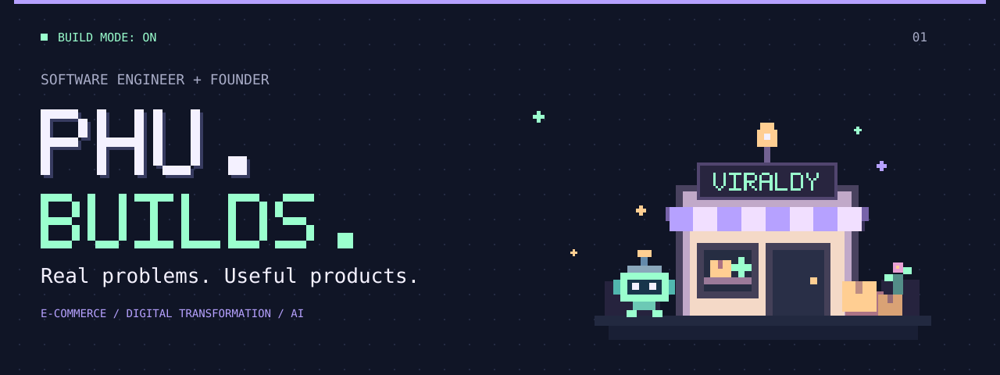

<picture>
  <source media="(max-width: 600px)" srcset="./assets/hero-mobile.svg">
  
</picture>

  

  <strong>Doan Hoang Thien Phu</strong> 
  Software engineer &amp; founder building <a href="https://github.com/dhtphu05/viraldy"><strong>Viraldy</strong></a>. 
  Turning real-world problems into useful <strong>SaaS products</strong> for 
  <strong>e-commerce, digital transformation, and AI-powered workflows</strong>.

  <a href="#-activity-highlights">Activity</a> &nbsp; · &nbsp;
  <a href="#-selected-builds">Selected builds</a> &nbsp; · &nbsp;
  <a href="#-my-toolbox">My toolbox</a> &nbsp; · &nbsp;
  <a href="https://github.com/dhtphu05?tab=repositories">Explore my repositories ↗</a>

## 🟩 Activity highlights

  <picture>
    <source media="(prefers-color-scheme: dark)" srcset="https://ghchart.xqsit94.in/dark:9affce/dhtphu05">
    
  </picture>

  Contribution activity over the past year · <a href="https://github.com/dhtphu05?tab=overview">View on GitHub ↗</a>

## 👾 The player behind the pixels

I care about what software makes possible for real people and businesses. My work brings together **software engineering, entrepreneurship, and innovation**: understand the problem, build something useful, learn, and improve.

- **E-commerce & creator affiliates:** tools for sellers, creator discovery, outreach, and affiliate workflows.
- **AI integration & video:** connecting LLMs to products and exploring AI-assisted video creation and creative iteration.
- **SaaS & digital transformation:** turning manual business processes into practical software products.
- **Third-party integrations:** connecting partner services, APIs, and tools into complete workflows.

## 🚀 Selected builds

### 🛍️ Viraldy · Founder / currently building

**Creative intelligence for e-commerce.** I'm building tools to analyze and iterate on creatives for TikTok Shop, print-on-demand, dropshipping, and cross-border commerce.

`Python` `FastAPI` `React` `OpenAI`

[Explore Viraldy →](https://github.com/dhtphu05/viraldy)

### 🤖 CrewOps AI

**From team conversations to coordinated action.** An AI teammate in Telegram that helps frontline teams recover staffing gaps, apply business rules, and bring in a manager when approval is needed.

`Node.js` `TypeScript` `LLM integration` `PostgreSQL`

[Explore CrewOps →](https://github.com/dhtphu05/crewops-ai)

### 🎟️ DUT Job Fair

**Digital tools for event operations.** A platform with QR check-in, booth management, rewards workflows, and dashboards for school and business teams.

`Next.js` `NestJS` `React` `PostgreSQL`

[Frontend →](https://github.com/dhtphu05/dut-job-fair-frontend) &nbsp; · &nbsp; [Backend →](https://github.com/dhtphu05/dut-job-fair-backend)

## 🧰 My toolbox

**Backend & APIs**

  
  
  
  

**Frontend**

  
  

**AI & exploration**

  
  
  

## 💡 What drives me

Real problems are the starting point. **Useful products are the goal.** I'm interested in exchanging ideas with founders and engineers building SaaS, e-commerce tools, AI video products, creator affiliate workflows, and partner integrations.

  <a href="https://github.com/dhtphu05/viraldy"><strong>Follow what I'm building with Viraldy ↗</strong></a>

